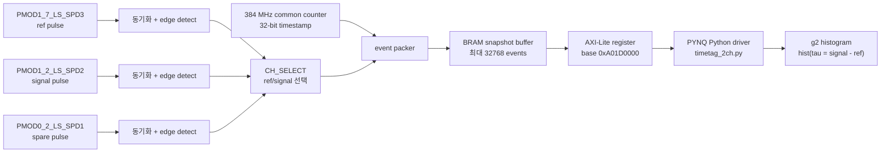

# ZCU111 2채널 Time Tagger 기반 g2 측정 구성 문서

작성일: 2026-07-10

대상 프로그램:

`D:\Vivado\260513_DYK_workspace\TCSPC260710_apply\KQOS_NV-main\KQOS_NV-main`

사용 overlay:

- `top_kist_ttag2ch_zcu111.bit`
- `top_kist_ttag2ch_zcu111.hwh`

이 문서는 ZCU111/PYNQ에서 `PMOD1_7_LS_SPD3`와 `PMOD1_2_LS_SPD2`를 g2/HBT 주력 채널로 쓰기 위한 2채널 time tagger의 구성 원리, 주요 코드 변경점, 테스트 방법을 정리한다.

## 1. 목표와 기본 전제

g2 측정에서는 두 SPD 펄스의 절대 도착 시간보다, ref 채널 펄스에 대해 signal 채널 펄스가 상대적으로 언제 들어왔는지가 중요하다. 이번 구성은 FPGA 내부에서 두 채널의 이벤트 timestamp를 BRAM snapshot buffer에 저장하고, Python에서 이를 읽어 `tau = signal_time - ref_time` 히스토그램을 만드는 방식이다.

기본 채널은 다음과 같다.

| 역할 | 물리 입력 | FPGA 내부 입력 | 채널 번호 |
|---|---|---:|---:|
| ref | `PMOD1_7_LS_SPD3` | `i_sig[2]` | `2` |
| signal | `PMOD1_2_LS_SPD2` | `i_sig[0]` | `0` |
| spare | `PMOD0_2_LS_SPD1` | `i_sig[1]` | `1` |

시간 기준은 384 MHz common counter이다.

```text
tick = 1 / 384 MHz = 2.6041666667 ns
```

따라서 이 구성의 기본 time bin은 약 `2.604 ns`이다. 이것은 coarse counter 방식이며, sub-clock fine TDC는 아니다. 입력 pulse 폭은 앞서 정한 기준대로 `5 ns 이상`을 가정한다.

## 2. 전체 개념도



핵심은 두 채널이 같은 384 MHz timestamp counter를 공유한다는 점이다. 그래서 두 채널의 timestamp 차이를 바로 상대 지연 시간으로 해석할 수 있다.

## 3. FPGA 내부 동작 개념

한 번의 capture는 다음 순서로 진행된다.

1. Python이 time tagger의 `VERSION`을 읽어 IP가 맞는지 확인한다.
2. Python이 `CAPTURE_LIMIT`와 `CH_SELECT`를 설정한다.
3. Python이 `CLEAR`와 `RESET_TIME`을 pulse로 넣어 BRAM과 timestamp counter를 초기화한다.
4. Python이 `ENABLE`을 켠다.
5. FPGA가 ref/signal edge를 감지할 때마다 현재 32-bit timestamp와 channel mask를 BRAM에 저장한다.
6. 다음 둘 중 하나가 먼저 발생하면 capture를 멈춘다.
   - 지정한 `capture_ms` 시간이 끝남
   - BRAM event buffer가 `CAPTURE_LIMIT`에 도달함
7. Python이 `ENABLE`을 끄고 저장된 event를 AXI-Lite로 읽는다.
8. Python이 ref/signal timestamp를 분리한 뒤 g2 histogram을 계산한다.

현재 기본 방식은 `stop-on-full snapshot`이다. 즉, BRAM 끝에 도달하면 덮어쓰지 않고 멈춘다. 긴 측정을 할 때는 Python test client가 snapshot을 반복 수행하고, 각 chunk를 파일로 저장한 다음 histogram을 누적한다.

## 4. Event 저장 형식

각 event는 timestamp와 채널 정보를 가진다.

| 읽는 레지스터 | 의미 |
|---|---|
| `EVENT_LO` | timestamp `[31:0]` |
| `EVENT_HI[1:0]` | channel mask |
| `EVENT_HI[3:2]` | flags |

channel mask 의미:

| 값 | 의미 |
|---:|---|
| `0x1` | ref event |
| `0x2` | signal event |
| `0x3` | ref와 signal이 같은 384 MHz tick에서 동시에 감지됨 |

timestamp는 32-bit이다. 384 MHz 기준 wrap 시간은 다음과 같다.

```text
2^32 / 384e6 = 약 11.18 s
```

현재 Python driver는 한 capture 안에서 timestamp wrap을 감지해 unwrap한다. 일반적인 snapshot capture는 이보다 훨씬 짧게 잡는 것이 좋다.

## 5. AXI-Lite Register Map

time tagger base address:

```text
BASE_ADD_TTAG2CH = 0xA01D0000
```

| Offset | 이름 | 방향 | 설명 |
|---:|---|---|---|
| `0x00` | `CONTROL` | R/W | enable, clear, reset, mode bit |
| `0x04` | `STATUS` | R | 현재 상태 bit |
| `0x08` | `EVENT_COUNT` | R | 현재 BRAM에 저장된 event 수 |
| `0x0C` | `TOTAL_COUNT` | R | clear 이후 받아들인 전체 event 수 |
| `0x10` | `OVERFLOW_COUNT` | R | overflow/drop event 수 |
| `0x14` | `WRITE_PTR` | R | BRAM write pointer |
| `0x18` | `CAPTURE_LIMIT` | W | 한 snapshot에서 받을 최대 event 수 |
| `0x1C` | `READ_INDEX` | W | 읽기 시작 index |
| `0x20` | `EVENT_LO` | R | timestamp |
| `0x24` | `EVENT_HI` | R | channel mask, flags |
| `0x28` | `TIME_NOW` | R | 현재 timestamp counter 값 |
| `0x2C` | `CH_SELECT` | W | ref/signal 입력 선택 |
| `0x30` | `VERSION` | R | 정상값 `0x54544731` (`TTG1`) |
| `0x34` | `DEPTH` | R | 정상값 `32768` |
| `0x38` | `TICK_HZ` | R | 정상값 `384000000` |
| `0x3C` | `EVENT_WIDTH` | R | event width 정보 |

`CONTROL` bit:

| bit | 이름 | 의미 |
|---:|---|---|
| 0 | `ENABLE` | capture enable |
| 1 | `CLEAR` | event buffer clear pulse |
| 2 | `RESET_TIME` | timestamp counter reset pulse |
| 3 | `CIRCULAR` | circular overwrite mode. 현재 기본 사용 안 함 |
| 4 | `STOP_ON_FULL` | buffer가 차면 멈춤 |
| 5 | `READ_AUTO_INC` | event read 시 pointer 자동 증가 |

`STATUS` bit:

| bit | 이름 | 의미 |
|---:|---|---|
| 0 | `ENABLED` | capture 동작 중 |
| 1 | `FULL` | buffer/capture limit 도달 |
| 2 | `OVERFLOW` | event drop 발생 |
| 3 | `WRAPPED` | circular mode에서 write pointer wrap |
| 4 | `DONE` | capture limit 도달 |
| 5 | `CAPTURE_READY` | capture/readout 가능 상태 |
| 6 | `CIRCULAR` | circular mode 활성 |
| 7 | `STOP_ON_FULL` | stop-on-full mode 활성 |

채널 선택값은 다음 식으로 만든다.

```text
CH_SELECT = ref_ch | (sig_ch << 4)
```

현재 g2 기본값:

```text
ref_ch = 2   # PMOD1_7_LS_SPD3 / i_sig[2]
sig_ch = 0   # PMOD1_2_LS_SPD2 / i_sig[0]
CH_SELECT = 0x02
```

ref/signal 정의를 뒤집고 싶으면 `ref_ch=0`, `sig_ch=2`로 보내면 된다. 이때 `tau = signal - ref`의 부호도 같이 바뀐다.

## 6. Python g2 계산 원리

현재 Python 결과는 정규화된 `g2(tau)`가 아니라 raw coincidence histogram이다.

계산 순서:

1. FPGA BRAM에서 event list를 읽는다.
2. channel mask를 보고 ref timestamp 배열과 signal timestamp 배열로 나눈다.
3. 필요하면 32-bit timestamp wrap을 보정한다.
4. 각 ref timestamp에 대해 `window_ticks` 안에 들어온 signal timestamp를 찾는다.
5. 아래 값을 histogram에 넣는다.

```text
tau_ticks = signal_timestamp - ref_timestamp
tau_ns    = tau_ticks * 2.6041666667 ns
```

기본 histogram 설정:

```text
window_ticks    = 512
bin_width_ticks = 1
hist_bins       = 1025
tau range       = 약 +/- 1333 ns
```

나중에 논문식 `g2(tau)` 형태가 필요하면 이 raw histogram에 대해 background subtraction, normalization, integration time 보정 등을 후처리로 추가하면 된다.

## 7. 주요 코드 변경점

### 7.1 Overlay 파일 추가

아래 파일을 KQOS runtime 폴더에 추가했다.

- `top_kist_ttag2ch_zcu111.bit`
- `top_kist_ttag2ch_zcu111.hwh`

기존 overlay인 `top_kist_zcu111.bit/hwh`는 삭제하지 않았다.

### 7.2 `main.py`

`KQOS_OVERLAY` 환경변수로 overlay를 선택하도록 변경했다.

기본 g2/time-tagger overlay:

```bash
export KQOS_OVERLAY=ttag2ch
python3 main.py
```

기존 3-SPD counter overlay로 되돌리기:

```bash
export KQOS_OVERLAY=legacy
python3 main.py
```

또한 g2 결과 JSON은 기존 counter 응답보다 크기 때문에 TCP 송신을 `sendall()`로 바꾸고 JSON을 compact하게 보낸다.

### 7.3 `address_v6.py`

time tagger 주소, 레지스터 offset, control/status bit, 기본 채널 mapping을 추가했다.

핵심 항목:

```python
BASE_ADD_TTAG2CH = 0x00_A01D_0000
TTAG_DEFAULT_REF_CH = 2
TTAG_DEFAULT_SIG_CH = 0
TTAG_DEFAULT_CAPTURE_LIMIT = 32768
TTAG_NOMINAL_TICK_HZ = 384000000
mmio_ttag2ch = MMIO(BASE_ADD_TTAG2CH, TTAG_RANGE)
```

### 7.4 `timetag_2ch.py`

PYNQ에서 time tagger를 제어하는 driver를 새로 추가했다.

주요 함수:

- `TimeTagger2CH.identify()`
- `TimeTagger2CH.status()`
- `TimeTagger2CH.configure()`
- `TimeTagger2CH.clear()`
- `TimeTagger2CH.start()`
- `TimeTagger2CH.stop()`
- `TimeTagger2CH.capture()`
- `TimeTagger2CH.read_events()`
- `TimeTagger2CH.split_channels()`
- `TimeTagger2CH.histogram_g2()`
- `acquire_g2()`

### 7.5 `Functions/g2.py`

KQOS command와 연결되는 `g2()` 함수를 추가했다.

현재 지원 mode는 `free_run`이다. 즉 QICK pulse sequence와 동기화하지 않고, 두 SPD 입력에 실제로 들어오는 pulse를 그대로 time tagging한다. 나중에 laser/MW pulse sequence와 동기화된 g2 mode를 별도로 추가할 수 있다.

### 7.6 `proc.py`

TCP command dispatch에 다음 항목을 추가했다.

```python
elif recv_data['command'] == 'g2':
    response['results'] = g2(soc, recv_data)
```

### 7.7 `test_g2_client.py`

PYNQ 내부 또는 PC에서 KQOS TCP server에 g2 측정을 요청하는 client를 추가했다.

지원 기능:

- single capture
- 지정 횟수 반복 capture
- 지정 시간 동안 반복 capture
- snapshot별 JSON 저장
- 누적 histogram JSON 저장
- 선택적으로 raw timestamp event 저장

## 8. PYNQ 터미널에서 기본 테스트

PYNQ 터미널 1에서 KQOS server를 실행한다.

```bash
cd /home/xilinx/<KQOS_NV-main_폴더>
export KQOS_OVERLAY=ttag2ch
python3 main.py
```

정상이라면 다음과 비슷한 로그가 보여야 한다.

```text
[INFO] Overlay profile: ttag2ch
[OK] bitstream pair found: ...
[OK] QickSoc initialized.
'Now ready.'
```

PYNQ 터미널 2에서 localhost로 g2 측정을 요청한다.

```bash
cd /home/xilinx/<KQOS_NV-main_폴더>
python3 test_g2_client.py \
  --host 127.0.0.1 \
  --capture-ms 100 \
  --capture-limit 32768 \
  --window-ticks 512 \
  --bin-width-ticks 1 \
  --out g2_pynq_test.json
```

예상 출력 형태:

```text
[0001] events=... ref=... sig=... full=False overflow=False coinc=... max_bin=...
saved=g2_pynq_test.json
g2 repeated capture complete
{
  "shots": 1,
  "total_events": ...,
  "total_ref_events": ...,
  "total_signal_events": ...,
  "total_coincidences": ...,
  "full_shots": ...,
  "overflow_shots": ...
}
```

`full=True`이면 지정 시간보다 먼저 BRAM event buffer가 찬 것이다. 이것 자체가 실패는 아니지만, count rate가 높거나 capture 시간이 길다는 뜻이다. `overflow=True`이면 event drop이 있었다는 뜻이므로 `capture_ms`를 줄이거나 입력 count rate를 낮추는 것이 좋다.

## 9. 반복 snapshot 저장 테스트

60초 동안 반복 측정하고, 각 snapshot과 누적 histogram을 저장하는 예:

```bash
python3 test_g2_client.py \
  --host 127.0.0.1 \
  --capture-ms 100 \
  --capture-limit 32768 \
  --total-s 60 \
  --out-dir g2_chunks \
  --aggregate-out g2_60s_sum.json
```

생성 파일:

```text
g2_chunks/g2_YYYYMMDD_HHMMSS_0001.json
g2_chunks/g2_YYYYMMDD_HHMMSS_0002.json
...
g2_60s_sum.json
```

정확히 100번 snapshot을 반복하려면:

```bash
python3 test_g2_client.py \
  --host 127.0.0.1 \
  --capture-ms 100 \
  --repeat 100 \
  --out-dir g2_chunks \
  --aggregate-out g2_sum.json
```

raw timestamp event까지 저장하려면:

```bash
python3 test_g2_client.py \
  --host 127.0.0.1 \
  --capture-ms 100 \
  --repeat 10 \
  --out-dir g2_raw_chunks \
  --return-raw \
  --max-raw-events 32768
```

raw mode는 파일이 커지므로 timing debug나 calibration에 주로 쓰는 것이 좋다.

## 10. TCP 없이 직접 MMIO smoke test

KQOS server를 거치지 않고 time tagger IP 자체를 확인하는 방법이다.

```bash
cd /home/xilinx/<KQOS_NV-main_폴더>
python3
```

Python prompt에서:

```python
from pynq import Overlay
ol = Overlay("top_kist_ttag2ch_zcu111.bit")

from timetag_2ch import TimeTagger2CH, acquire_g2

t = TimeTagger2CH()
print(t.identify())
print(t.status())

r = acquire_g2(
    capture_ms=100,
    capture_limit=32768,
    ref_ch=2,
    sig_ch=0,
    window_ticks=512,
    bin_width_ticks=1,
)

print(r["meta"])
print("hist_bins =", len(r["hist"]))
print("total_coincidences =", sum(r["hist"]))
print("max_bin =", max(r["hist"]) if r["hist"] else 0)
```

정상 identity:

```text
version = 0x54544731
depth = 32768
tick_hz = 384000000
```

`VERSION`이 `0x54544731`이 아니면 대부분 다음 중 하나이다.

- `ttag2ch` overlay가 올라가지 않았다.
- `.bit`와 `.hwh` pair가 맞지 않는다.
- Python 코드의 AXI base address와 FPGA address map이 다르다.

## 11. 실제 실험 검증 순서

### 11.1 No-input test

SPD 입력을 연결하지 않고 측정한다.

정상 기대:

- `event_count`가 거의 0
- `ref_events`와 `signal_events`가 거의 0
- `overflow=False`

### 11.2 같은 pulse split test

같은 pulse source를 splitter로 두 입력에 동시에 넣는다.

정상 기대:

- `tau_ns = 0` 근처에 강한 peak
- cable delay를 넣으면 peak가 그만큼 이동
- peak 위치는 약 `2.604 ns` tick 단위로 quantize됨

### 11.3 cable delay 부호 확인

현재 정의는 다음과 같다.

```text
tau = signal_timestamp - ref_timestamp
```

따라서 signal 경로가 ref보다 늦으면 peak는 positive tau 방향으로 이동해야 한다. 원하는 plotting convention과 반대라면 command에서 `ref_ch`와 `sig_ch`를 바꾸거나, 후처리에서 tau 부호를 뒤집으면 된다.

### 11.4 high count-rate 확인

반복 측정 중 다음 상태가 자주 뜨면:

```text
full=True
```

BRAM buffer가 `capture_ms`가 끝나기 전에 찬 것이다. 이 경우 실제 snapshot 길이는 지정 시간보다 짧아진다.

다음 상태가 뜨면:

```text
overflow=True
```

event drop이 발생한 것이다. `capture_ms`를 줄이거나 count rate를 낮춰야 한다.

## 12. JSON 결과 구조

single capture 결과 예:

```json
{
  "results": {
    "tau_ticks": [-512.0, -511.0, "...", 512.0],
    "tau_ns": [-1333.333, -1330.729, "...", 1333.333],
    "hist": [0, 1, 3, "...", 0],
    "meta": {
      "capture_ms_requested": 100.0,
      "capture_limit": 32768,
      "event_count": 12345,
      "ref_events": 6000,
      "signal_events": 6345,
      "tick_hz": 384000000,
      "tick_ns": 2.6041666667,
      "ref_ch": 2,
      "sig_ch": 0,
      "channel_map": {
        "ref": "PMOD1_7_LS_SPD3",
        "signal": "PMOD1_2_LS_SPD2"
      },
      "version": "0x54544731",
      "depth": 32768
    }
  }
}
```

반복 측정 누적 결과 예:

```json
{
  "tau_ticks": ["..."],
  "tau_ns": ["..."],
  "hist": ["summed histogram"],
  "captures": ["per-chunk summaries"],
  "meta": {
    "shots": 100,
    "total_events": 1234567,
    "total_ref_events": 600000,
    "total_signal_events": 634567,
    "total_coincidences": 123456,
    "full_shots": 10,
    "overflow_shots": 0
  }
}
```

## 13. 현재 한계

- 시간 해상도는 약 `2.604 ns`이다.
- BRAM snapshot 기반이라 완전한 no-dead-time streaming은 아니다.
- 반복 측정에서는 chunk 사이에 AXI readout과 JSON 저장으로 인한 dead time이 있다.
- 현재 `hist`는 raw coincidence histogram이며, 정규화된 `g2(tau)`는 아니다.
- count rate가 높으면 32768-event buffer가 `capture_ms` 전에 찰 수 있다.
- 현재 mode는 `free_run`이며, QICK pulse program과 동기화된 mode는 아직 추가하지 않았다.

## 14. Rollback

기존 3-SPD counter overlay로 되돌리고 싶으면:

```bash
export KQOS_OVERLAY=legacy
python3 main.py
```

초기 runtime 수정 전 backup:

- `address_v6.py.20260710_180527.bak`
- `main.py.20260710_180527.bak`
- `proc.py.20260710_180527.bak`

